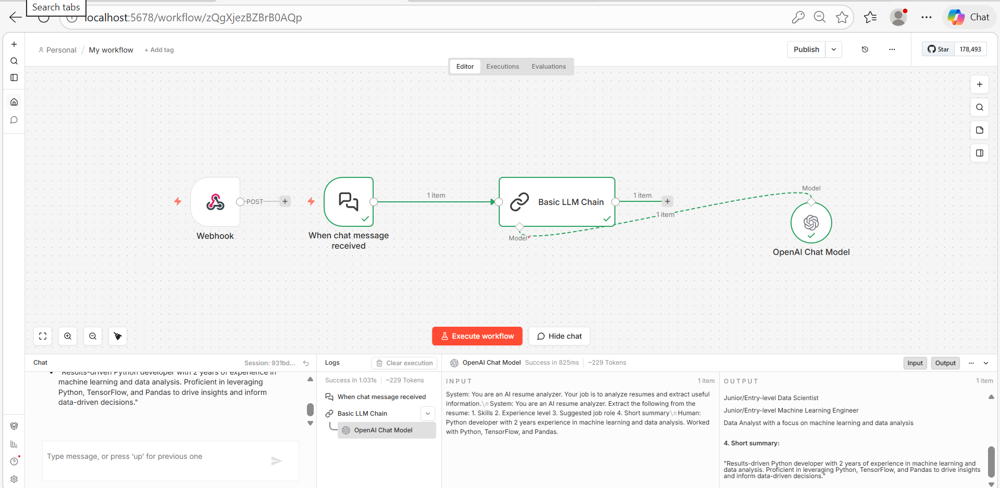

# AI Resume Analyzer using n8n

This project is an AI-powered Resume Analyzer built using n8n and OpenAI.

## Features
- Extracts skills from resumes
- Suggests suitable job roles
- Uses LLM automation workflow
- Built using n8n automation tool

## Workflow
Webhook → Chat Trigger → LLM Chain → OpenAI Model

## Technologies Used
- n8n
- OpenAI API
- AI / LLM
- Automation workflow

## Screenshot

